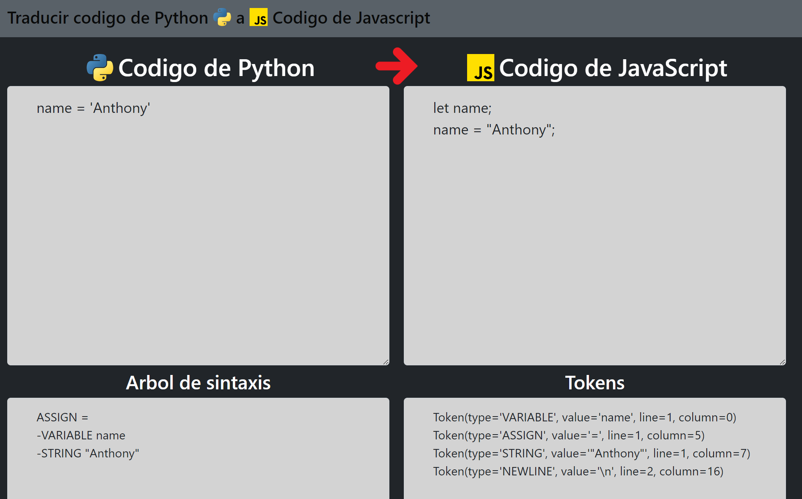

# code_Translator
1. Ejercicios:
   * Desarrollar un traductor de código a otro. (Ejemplo, si mi lenguaje es Java que se pueda llevar a JS o C++).
   * Documentar todo el lenguaje de programación.
   * Subir Proyecto a nube.utesa.

2. Comandos necesarios para ejecutar la app
    * Debemos instalar python y pip. Para verificar que lo tenemos en CMD poner los siguientes comandos: python --version, pip --version
    * En visual studio code en la terminal, instalar las siguientes dependencias:
      * pip install flask
    * Luego en la terminal ir a la carpeta webapp y ejecutamos: python app.py

3. Pruebas de código para realizar en el TRADUCTOR DE CODIGO.
    Ejemplo #1
    print("Hola, Mundo!")

    Ejemplo #2
    num1 = 10.5
    num2 = 8.2
    suma = num1 + num2
    suma = 18.7

    Ejemplo #3
    fruta1 = "manzana"
    fruta2 = "plátano"
    fruta3 = "cereza"
    fruta4 = "mango"


4. Documentar Lenguaje utilizado en el traductor de codigo para realizar pruebas.
  ```python
  toJS = {
    'True': 'true',
    'False': 'false',
    'print': 'console.log',
    'math.sin': 'Math.sin',
    'math.cos': 'Math.cos',
    'math.tan': 'Math.tan',
    'math.sqrt': 'Math.sqrt',
    'abs': 'Math.abs',
    'and': '&&',
    'or': '||',
}

MARGIN = '\t'


class CodeGenerator:
    def __init__(self) -> None:
        self.output = ''
        self.variables = set()

    def genJavaScriptNode(self, node: ExpressionNode, level=0, end='') -> str:
        if type(node) == BlockNode:
            out = MARGIN * level + f'{node.operator.value}'
            out += ' (' + self.genJavaScriptNode(node.statement, 0, ') {\n')
            for subnode in node.body:
                out += self.genJavaScriptNode(subnode, level + 1, '\n')
            out += MARGIN * level + '}'
            return out + end

        elif type(node) == ElseNode:
            out = MARGIN * level + f'{node.operator.value}' + ' {\n'
            for subnode in node.body:
                out += self.genJavaScriptNode(subnode, level + 1, '\n')
            out += MARGIN * level + '}'
            return out + end

        elif type(node) == UnarOperatorNode:
            if node.operator.value == 'print':
                out = MARGIN * level + \
                    f'{toJS[node.operator.value] if node.operator.value in toJS.keys() else node.operator.value}({self.genJavaScriptNode(node.operand, 0, ");")}'
            else:
                out = MARGIN * level + \
                    f'{toJS[node.operator.value] if node.operator.value in toJS.keys() else node.operator.value}({self.genJavaScriptNode(node.operand, 0, ")")}'
            return out + end

        elif type(node) == BinOperatorNode:
            if node.operator.type == 'ASSIGN' and node.leftNode.value.value not in self.variables:
                out = MARGIN * level + f'let {node.leftNode.value.value};\n'
                self.variables.add(node.leftNode.value.value)
                out += self.genJavaScriptNode(node, level)
            elif node.operator.type == 'ASSIGN':
                out = MARGIN * level + \
                    f'{self.genJavaScriptNode(node.leftNode, 0)} = {self.genJavaScriptNode(node.rightNode, 0, ";")}'
            else:
                out = MARGIN * level + \
                    f'{self.genJavaScriptNode(node.leftNode, 0, " ")}{toJS[node.operator.value] if node.operator.value in toJS.keys() else node.operator.value} {self.genJavaScriptNode(node.rightNode, 0)}'
            return out + end

        elif type(node) == ValueNode:
            out = MARGIN * level + \
                f'{toJS[node.value.value] if node.value.value in toJS.keys() else node.value.value}'
            return out + end

        else:
            return '\n'

    def genJavaScript(self, root: StatementNode) -> str:
        for node in root.codeStrings:
            self.output += self.genJavaScriptNode(node, 0, '\n')
        return self.output
  ```

5. Imagen de portada.


